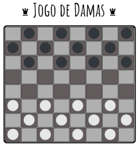

# Jogo de Damas

## ***Autores:***

* @IgorBandasz
* @estercardosotoja
* @rohju

## ***Motivação e Objetivo:***

A motivação desse projeto é realizar atividade da disciplina de Inteligencia Artificial, utilizando os Agentes Reativos os quais observam o ambiente e executa uma ação e os Agente Reativos com Estados possui um armazenamento de alguma informação para que possa executar a ação, após a observação do ambiente.

## ***Como foi desenvolvido:***

### Para Organização do trabalho

* **Google Meet**:
    Para as reuniões semanais e alinhamento dos integrantes.
  
* **Trello**:
  Para organização das responsabilidade e acompanhamento do progresso de desenvolvimento.
  
* **GitHub**:
  Para acesso compartilhado dos códigos desenvolvidos.

### Tecnologias utilizadas

#### *Front-End*

* **HTML5**:  
  Utilizada para marcação e organização da estrutura do conteúdo do jogo em tela.
  
* **CSS**:  
  Em conjunto com o html auxiliando na aparência e estilo dos itens adicionados.
  
* **Markdown:**  
  Utilizada para desenvolvimento do README.
  
#### *Back- End*

* **JavaScript:**  
  Precisamente aqui é onde a mágica acontece, onde as regras dos jogo são traduzidas para a linguagem de programação.
  
#### *IDE*

* **Visual Studio Code:**  
  Espaço para colocar a mão na massa no desenvolvimento do front e back end.

## ***Funcionalidades:***

O jogo foi desenvolvido tal que um oponente será **Humano** e outro será a **Máquina**. Sabendo disso seguem as funcionalidades do sistema:

* **Organiza o tabulheiro:**

    A cada movimento que é realizado uma atualização das posições atuais na matriz do tabuleiro, indicando as células livres e ocupadas.

* **Sorteia peça máquina:**

    Diferente do Humano que escolhe as suas próprias peças para movimentar, a máquina terá um sorteador para escolher qual a peça que será movida.

* **Verifica movimento livre:**

    A implementação do nosso agente entra nesta parte, onde será realizada a análise no ambiente para a movimentação, sendo que:
      1. Peças **Comuns** podem se mover somente para diagonal direita ou esquerda a sua frente;
      2. Peças **Damas** podem se mover para ambas as diagonais e para frente e para trás.

    Ambas com casas imediatamente livres ou com peça inimiga e livre, sendo a segunda o objeto do nosso próximo item.

    

* **Retirar peça para o cemitério:**

    Quando é realizado o movimento de tomada da peça adversária, o sistema retirará o ícone/peça do tabuleiro e colocará no ambiente cemitério do jogador que ganhou aquele lance.

    

* **Montar Dama:**

    Verificando que a peça (preta/branca) tenha atravessado todo o tabuleiro até a última "linha" da área do oponente, o sistema retirará a peça comum e irá transformá-la em dama. Em resumo será feita uma troca de ícones.

    

* **Mostrar rodada:**

    Na barra superior da página o jogado poderá conferir de quem é a rodada atual, podendo verificar que sendo:
   1. O emoji de um robozinho :robot: será a vez da máquina;
   2. Caso apareça este emoji :grinning: é do humano.

        

* **Cronômetro**

    Há um cronômetro que é inicializado no momento no primeiro movimento realizado pelo Jogador Humano, este tem como objetivo cronometrar o tempo de jogo até a última tomada por um dos últimos jogadores.

* **Duvidas e Sujestões**

    Há icone destinado a duvidas e sujestões. Ao ser selecionado é aberto uma nova aba com links de direcionamento.

* **Como jogar:**  
    É direcionado para o Readme.md do projeto no Git Hub onde é descrito as Regras do Jogo.

* **Como foi desenvolvido:**  
    É direcionado para o Readme.md do projeto no Git Hub onde é descrito as tecnologias e detalhes do desenvolvimento.

* **Entrar em Contato:**  
    É direcionado para a aba de Issues do GitHub para que possa ser aberto alguma reclamação ou sujestão de melhoria.

* **Final do Jogo:**
    Ao finalizar o jogo é apresentado um popup informando se o jogador Humano ganhou, perdeu e empate. Junto há um button para inciar um nova partida.

## ***Regras do Jogo:***

### Objetivo do Jogo

* Capturar ou imobilizar as peças do adversário. O jogador que conseguir capturar todas as peças do inimigo ganha a partida.

### Regras Tabuleiro

* O jogo de damas pratica-se entre dois jogadores, num tabuleiro quadrado, de 64 casas alternadamente claras e escuras, dispondo de 12 peças brancas e 12 pretas.
  
* O tabuleiro deve ser colocado de modo que a casa angular à esquerda de cada parceiro seja escura.

* No início da partida, as peças devem ser colocadas no tabuleiro sobre as casas escuras, da seguinte forma: nas três primeiras filas horizontais, as peças brancas; e, nas três últimas, as peças pretas.

    

### Regras de Movimentação

* A peça movimenta-se em diagonal, sobre as casas escuras, para a frente, e uma casa de cada vez.
* A peça pode capturar a peça do adversário movendo-se para frente na diagonal.
* A peça que atingir a oitava casa adversária, parando ali, será promovida a "Dama", peça de movimentos mais amplos que a simples peça. Assinala-se a dama sobrepondo, à pedra promovida, outra da mesma cor.
* A Dama pode mover-se para trás e para frente em diagonal uma casa de cada vez, diferente das outras peças, que movimentam-se apenas para frente em diagonal. A Dama pode também tomar outra peça pela frente ou por trás em diagonal.
* Quando a uma peça tomar a peça adversária irá ter mais uma oportunidade de realizar outro movimento, não sendo necessáriamente sendo a mesma peça do primeiro movimento.

### Demais Regras

* As Peças tomadas só deverão ser retiradas do tabuleiro depois de completo o lance.
* As **brancas têm sempre a saída**, isto é, o primeiro lance da partida.
* O lance está completo quando O jogador tiver selecionado a casa da peça, e selecionar a casa destino movando-a para a casa destino.

### A partida termina

#### Ganha

* Um dos lados elimina todas as peças do adversário.

#### Perde

* Um dos lados tem suas peças todas eliminadas.

#### Empate

* Quando é realizada 10 movimentações de um dos jogadores sem a tomada de nenhuma peça então o jogo é finalizado por Empate.
  
